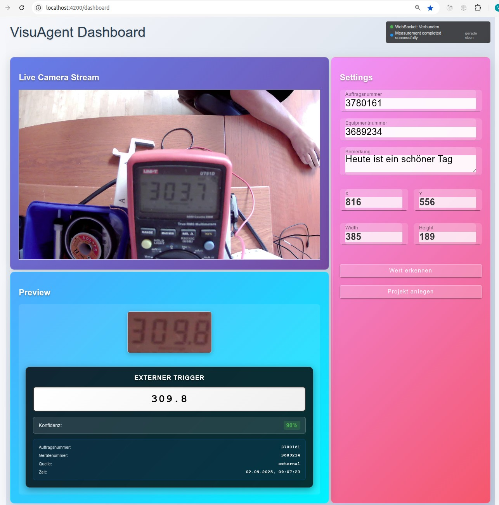

# VisuAgent - AI-Powered Measurement Value Recognition



VisuAgent ist eine Spring Boot + Angular Anwendung für Kalibrierlabore zur automatischen Extraktion von Messwerten aus Gerätedisplays mittels Kamera-Input und OpenAI Vision API. Das System erfasst Live-Video/Bilder von USB-Kameras, ermöglicht Benutzern die Auswahl von ROI-Bereichen (Region of Interest) und nutzt KI zur Erkennung angezeigter Messwerte.

## Funktionsweise

### 1. Kalibrierung einrichten
1. **Eingabe der Stammdaten**: Benutzer gibt Auftragsnummer und Gerätenummer ein
2. **ROI-Auswahl**: Markierung des Bereichs im Live-Kamera-Stream, wo der Messwert angezeigt wird
3. **Preview**: Der ausgewählte Ausschnitt wird im Preview-Fenster angezeigt
4. **Kalibrierung speichern**: Mit Klick auf "Projekt anlegen" wird die Konfiguration gespeichert

### 2. AI-basierte Messwerterfassung
- **Bildverarbeitung**: Nur der ROI-Bereich (der eigentliche Messwert) wird zur KI geschickt
- **OpenAI Vision**: Die KI analysiert das Bild und extrahiert den Messwert
- **Konfidenz-Bewertung**: Indikator (0-100%), wie sicher die KI den Wert erkannt hat
  - 90% = Wert wurde ziemlich sicher erkannt
  - Bei schlechter Bildqualität (z.B. Spiegelung) sinkt die Konfidenz

### 3. Externe API-Integration

Ihr Messverstärker/System kann einfach einen API-Call absetzen:

**Request:**
```http
POST http://localhost:8082/api/trigger
Content-Type: application/json

{
  "orderNumber": "3780161",
  "equipmentNumber": "3689234"
}
```

**Response:**
```json
{
  "status": "success",
  "message": "Measurement triggered and result sent to frontend",
  "sessionId": "163cb355-4ccd-4a57-90f1-00c9b58fc5c5",
  "timestamp": "2025-09-02T09:07:23.793437462",
  "value": 309.8,
  "confidence": 0.9,
  "roiImageBase64": "data:image/jpeg;base64,/9j/4AAQSkZJRgABAgA....",
  "orderNumber": "3780161",
  "equipmentNumber": "3689234"
}
```

**Response-Felder:**
- `value`: Von der KI erkannter Messwert
- `confidence`: Konfidenz-Level (0.0-1.0)
- `roiImageBase64`: Das Preview-Bild, das zur KI geschickt wurde (Base64-codiert)
- `orderNumber/equipmentNumber`: Zur Verifikation

## Architektur

### Backend (Spring Boot 3.5.4, Java 21)
- **Port**: 8082
- **Main Package**: `de.testo.cal.visuagent`
- **Key Components**:
  - `TriggerController` - Externe API (`/api/trigger`)
  - `MeasurementController` - Measurement processing (`/api/measurements`)  
  - `StreamController` - Video streaming (`/api/stream`)
  - `OpenAiServiceWrapper` - OpenAI integration
  - `WebSocketMessagingService` - Real-time communication

### Frontend (Angular 20, TypeScript)
- **Port**: 4200
- **State Management**: NgRx (Redux pattern)
- **UI Library**: Angular Material
- **Key Components**:
  - `VideoViewerComponent` - Live-Kamera und ROI-Auswahl
  - `DashboardComponent` - Hauptanwendung
  - `SettingsComponent` - Konfiguration
  - `PreviewComponent` - ROI-Vorschau und Messergebnisse
  - `StatusIndicatorComponent` - WebSocket-Verbindungsstatus

## Installation & Setup

### Voraussetzungen
- Java 21+
- Node.js 18+
- OpenAI API Key
- USB-Kamera

### Backend starten
```bash
cd backend
export OPENAI_API_KEY="your-api-key-here"
./mvnw spring-boot:run
```

### Frontend starten
```bash
cd frontend
npm install
npm start
```

### Zugriff
- **Frontend**: http://localhost:4200
- **Backend API**: http://localhost:8082
- **OpenAPI Docs**: http://localhost:8082/swagger-ui.html

## Konfiguration

### Umgebungsvariablen
```bash
# Backend
export OPENAI_API_KEY="sk-proj-your-key"
export OPENAI_API_URL="https://api.openai.com/v1"
```

### Kamera-Setup
- USB-Kamera wird automatisch erkannt (`/dev/video0`)
- Unterstützte Kameras: JOYACCESS und Standard UVC-Kameras
- Stream-Format: MJPEG, 5 FPS

## API-Dokumentation

### Trigger API (Externe Integration)
```http
POST /api/trigger
```

**Erfolgreiche Response:**
- `status`: "success"
- `value`: Erkannter Messwert (Float)
- `confidence`: KI-Konfidenz (0.0-1.0)
- `roiImageBase64`: Base64-kodiertes Vorschaubild

**Fehler-Response:**
- `status`: "not_found" | "error"
- `message`: Fehlerbeschreibung
- Messwert-Felder sind `null`

### Weitere Endpoints
- `GET /api/stream` - Live-Kamera-Stream
- `POST /api/measurements` - Manuelle Messung
- `GET /api/trigger/health` - Health Check

## Real-Time Features

### WebSocket-Integration
- **Endpoint**: `ws://localhost:8082/ws`
- **Topics**:
  - `/topic/measurement` - Messergebnisse
  - `/topic/status` - Verarbeitungsstatus
- **Frontend**: Automatische Anzeige externer Trigger-Ergebnisse

### Status-Indikator
- WebSocket-Verbindungsstatus
- Externe Trigger-Aktivität
- Verarbeitungsstatus mit visuellen Indikatoren

## Entwicklung

### Backend-Tests
```bash
./mvnw test
```

### Frontend-Tests
```bash
npm test                # Unit tests (Jasmine/Karma)
npm run e2e            # E2E tests (Playwright) 
ng lint                # Linting
```

### Build
```bash
# Backend
./mvnw clean install

# Frontend  
npm run build
```

## Integration in bestehende Systeme

Das System ist so konzipiert, dass es einfach in bestehende Messsysteme integriert werden kann:

1. **Kalibrierung** über das Web-Interface einmalig einrichten
2. **API-Integration** in euer Messsystem einbauen
3. **Response-Verarbeitung** ähnlich wie bei manueller Tastatureingabe

Euer Messverstärker muss das JSON-Response verarbeiten und den `value` weiterverwenden. Der Prozess ersetzt die manuelle Tastatureingabe durch automatische KI-Erkennung.

## Support & Entwicklung

- **Technologie-Stack**: Spring Boot, Angular, OpenAI GPT-4o Vision
- **Datenbank**: H2 (In-Memory) für Kalibrierungsdaten
- **Logging**: Umfangreiches Logging für Debugging
- **Error Handling**: Robuste Fehlerbehandlung für Kamera- und API-Ausfälle

---

*VisuAgent - Automatisierte Messwerterfassung für moderne Kalibrierlabore*
